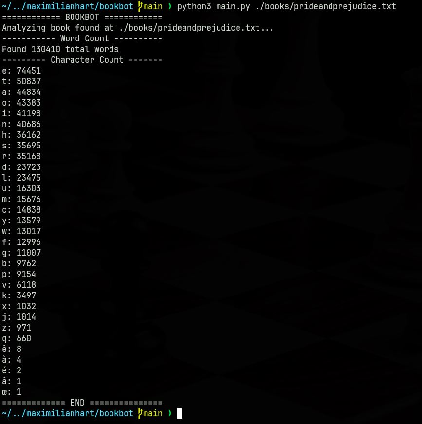

# BookBot

BookBot is [Boot.dev](https://www.boot.dev)'s first project, and it was a blast to make!

It's a little tool that analyzes a txt file input and outputs the total word count and how many times each letter shows up.

It simply iterates through the file and does some conversion and sorting between lists & dictionaries.

## Usage

To run BookBot:

### 1. Clone the repo

Navigate to where you want the BookBot folder to live and run:

```bash
git clone https://github.com/maximilianhart/bookbot
cd bookbot
```

### 2. Grab a text file to analyze:

We'll use Pride & Prejudice because it's a fantastic book:

```bash
mkdir books
curl https://www.gutenberg.org/cache/epub/1342/pg1342.txt > ./books/prideandprejudice.txt
```

### 3. Run the program!

```bash
python3 main.py ./books/prideandprejudice.txt
```

### 4. Profit! Somehow.


